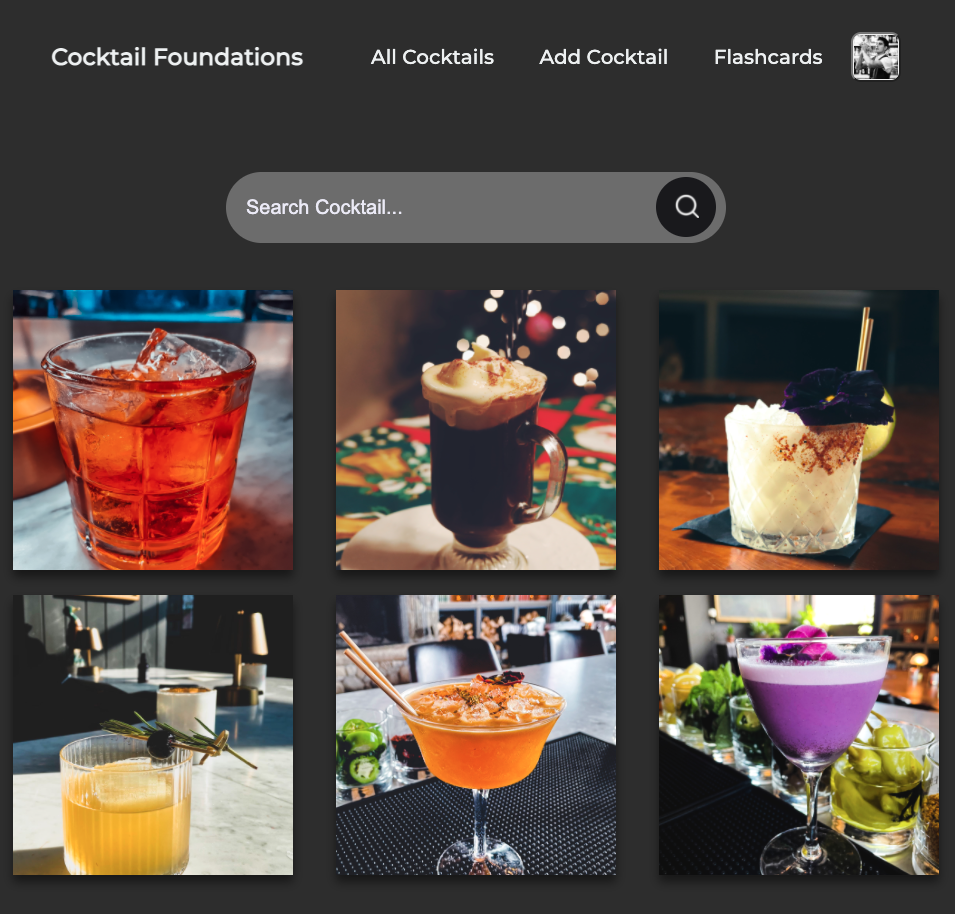

# Cocktail Foundations

## [Link To The App Here](https://cocktail-foundations.herokuapp.com/cocktails "Cocktail Foundations").

## About:
This app is for studying cocktail recipes and being inspired by other cocktail creations. When you start at a new bar, you have to memorize all the signature cocktails. This app simplifies that process. 

## How To Use:
1. Login to a google account and create a cocktail. 
2. Find your cocktail and click to edit it.
3. Fill out your cocktail's recipe and other descriptions, include a picture if you have one. (I would recommend taking actual pictures of your bar's drinks as they are made, this makes the memorization process more effective.) 
4. Proceed to the flashcards section where it will browse through your personal flashcards. 

If you want to study the "foundation cocktails" there is a foundation cocktail study tab, these are the core cocktails that every bartender should know taken from "How To Be A Successful Bartender" online course on Udemy.com. Lastly all of the cocktails made by Bartender's around the world will be displayed on the “All Cocktails” tab.  Take a look at your creations or get inspired by other bartender's cocktails. 

## Additional Information:
Another Reason this app was created; While bartending you sometimes get a request for a drink that you know exists but are not exactly sure of the recipe. You then proceed to search on your phone for this drink and find all these websites with ads attached to them and have to do extra work to scroll down to locate the actual recipe. This app gets straight to the point. The home page is a large search bar where you can search for the cocktail you need and get the recipe with one click.

## Technologies Used:

                   
## Future Enhancements:

1. light/dark mode
2. Mobile Responsive NavBar
3. FlashCard Flip Animation
4. Mobile Response
5. Large Screen Response

